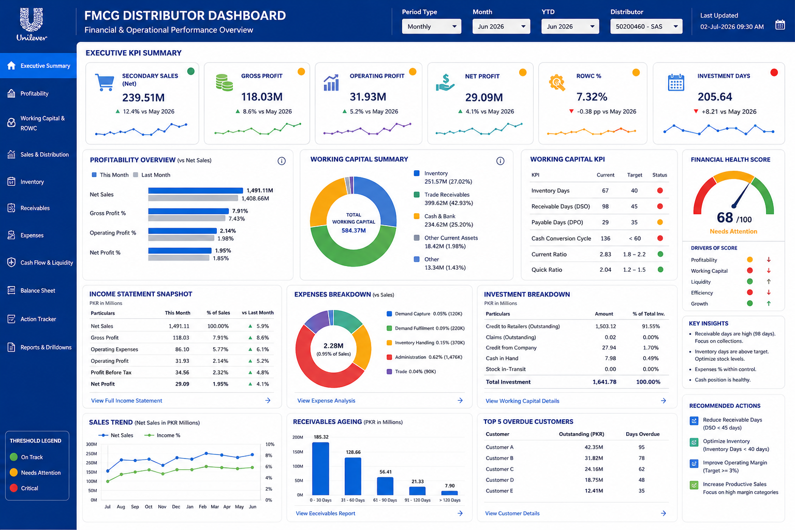
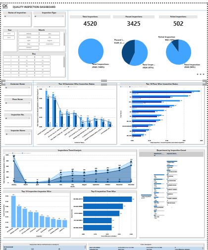

# FMCG Distributor Dashboard

### Overview

The FMCG Distributor Dashboard provides a comprehensive view of a distributor's financial and operational performance. It enables management to monitor key business metrics, evaluate profitability, analyze working capital, and make data-driven decisions through interactive visualizations and KPIs.

### Key Features

- Executive KPI Summary including:
  - Secondary Sales
  - Gross Profit
  - Operating Profit
  - Net Profit
  - Return on Working Capital (ROWC)
  - Investment Days
- Profitability analysis with Month-over-Month comparison.
- Working Capital Summary and Investment Breakdown.
- Working Capital KPIs with target vs actual performance indicators.
- Financial Health Score with performance status.
- Income Statement Snapshot.
- Expense Breakdown by category.
- Sales Trend analysis over time.
- Receivables Aging analysis.
- Top Overdue Customers with outstanding balances.
- Key Insights and Recommended Actions for business improvement.
- Interactive filters for Period Type, Month, Year-to-Date (YTD), and Distributor.

### Business Value

- Monitor distributor financial performance in real time.
- Identify profitability trends and operational efficiency.
- Track working capital and cash flow health.
- Detect overdue customer payments and improve collections.
- Support management with actionable insights for better decision-making.

### Tools Used

- Power BI
- SQL
- DAX
- Power Query
- Data Modeling

### Skills Demonstrated

- KPI Dashboard Design
- Financial Reporting
- Working Capital Analysis
- Profitability Analysis
- DAX Measures
- Data Modeling
- Interactive Reporting
- Business Intelligence
- Data Warehousing

### Screenshot

# Quality Inspection Dashboard

### Overview

The Quality Inspection Dashboard was designed for a textile manufacturing company to monitor product quality, track inspection activities, and evaluate inspector performance. It provides a centralized view of inspection results, quality trends, and operational metrics, enabling management to identify issues early and improve manufacturing quality.

### Key Features

- Executive KPI cards displaying Total Inspections, Passed Inspections, Failed Inspections, and Pass Rate.
- Interactive filters for Status, Year, Month, Day, Customer, Floor, Inspector Number, and Inspector Name.
- Top 10 Customers and Top 10 Floors based on inspection volume and quality performance.
- Inspection Trend Analysis to monitor quality performance over time.
- Top 10 Inspectors and Top 5 Inspection Time analysis to evaluate inspection efficiency.
- Department-wise Inspection Count for operational performance monitoring.
- Inspector Performance and Time Analysis to identify productivity and quality trends.
- Interactive and user-friendly visualizations for quick business insights.

### Business Value

- Monitors product quality across the manufacturing process.
- Identifies quality issues and inspection trends.
- Tracks inspector productivity and performance.
- Supports data-driven quality improvement and operational decision-making.

### Tools Used

- Power BI
- SQL
- Oracle Database

### Skills Demonstrated

- Dashboard Design
- Data Modeling
- DAX
- Power Query
- SQL Querying
- Oracle Database Integration
- Data Visualization
- Business Intelligence

### Screenshot

# HR Analytics Dashboard

### Overview

The HR Analytics Dashboard provides a comprehensive view of workforce performance, employee demographics, hiring, and attrition trends. It enables HR teams and management to monitor key workforce metrics, identify retention challenges, and support strategic workforce planning through interactive visualizations.

### Key Features

- Executive HR KPIs including:
  - Total Active Headcount
  - Budgeted Headcount
  - Headcount by Gender
  - Headcount by Employee Type
- Attrition & Retention analysis with:
  - YTD Attrition Rate
  - New Hires (MTD)
  - Separations (MTD)
  - Average Employee Tenure
- Attrition trend analysis over the last 12 months.
- Voluntary vs. Involuntary separation analysis.
- Top separation reasons for employee turnover.
- Workforce profile by:
  - Age Group
  - Tenure
  - Employee Cadre
- Department-wise headcount summary and fill percentage.
- Interactive filters for Region, Division, Unit, Department, Section, Employee Type, Cadre, and Subclass.

### Business Value

- Monitor workforce growth and staffing levels.
- Analyze employee attrition and retention trends.
- Identify key reasons for employee turnover.
- Evaluate department-wise workforce utilization.
- Support data-driven HR planning and talent management.

### Tools Used

- Power BI
- SQL
- DAX
- Power Query
- Data Modeling
- Oracle

### Skills Demonstrated

- HR Analytics
- Workforce Analytics
- KPI Dashboard Design
- DAX Measures
- Data Modeling
- Interactive Reporting
- Data Visualization
- Business Intelligence

### Screenshot

